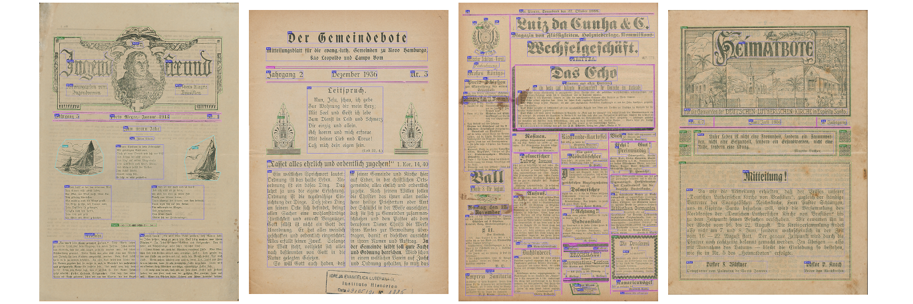

   <h1 id="title">German-Brazilian-Newspapers-Dataset Part 2</h1>
   
The GBN Dataset consists from four different German-Brazilian historical
newspapers, along with their digital and binarized images and ground truth
files. The GBN-Dataset Corpus consists of two parts. 
The parts are designated numerically. 
German-Brazilian-Newspapers-Dataset_1 = Part 1,
German-Brazilian-Newspapers-Dataset_2 = Part 2.
It is a dataset created for evaluation of layout analysis methods.

   <h2>Metadata</h2>
   <dl class="grid">
      <dt id="Language">Language:</dt>
      <dd>deu</dd>
      <dt id="Format">Format:</dt>
      <dd>Page-XML</dd>
      <dt id="Time">Time:</dt>
      <dd>1863-1880</dd>
      <dt id="GTT">GT Type:</dt>
      <dd>data_structure</dd>
      <dt id="License">License:</dt>
      <dd>PublicDomainMark 1.0</dd>
      <dt id="Project">Project:</dt>
      <dd>German-Brazilian Newspapers (GBN) </dd>
      <dt id="Project-URL">Project-URL:</dt>
      <dd>https://web.inf.ufpr.br/vri/databases/gbn/</dd>
   </dl>
   <h2>Sources</h2>
   <h3>The volume of transcriptions:</h3>
   <table id="table_id">
      <thead>
         <tr>
            <th>TxtRegion</th>
            <th>ImgRegion</th>
            <th>LineDrawRegion</th>
            <th>GraphRegion</th>
            <th>TabRegion</th>
            <th>ChartRegion</th>
            <th>SepRegion</th>
            <th>MathRegion</th>
            <th>ChemRegion</th>
            <th>MusicRegion</th>
            <th>AdRegion</th>
            <th>NoiseRegion</th>
            <th>UnkownRegion</th>
            <th>CustomRegion</th>
            <th>TextLine</th>
            <th>Page</th>
         </tr>
      </thead>
      <tbody>
         <tr>
            <td>1967</td>
            <td>0</td>
            <td>0</td>
            <td>95</td>
            <td>0</td>
            <td>0</td>
            <td>467</td>
            <td>0</td>
            <td>0</td>
            <td>0</td>
            <td>0</td>
            <td>0</td>
            <td>0</td>
            <td>0</td>
            <td>0</td>
            <td>34</td>
         </tr>
      </tbody>
   </table>
   

      <h3>List of transcriptions</h3>
      

         <table id="table_id" class="display">
            <thead>
               <tr>
                  <th>document</th>
                  <th>TxtRegion</th>
                  <th>ImgRegion</th>
                  <th>LineDrawRegion</th>
                  <th>GraphRegion</th>
                  <th>TabRegion</th>
                  <th>ChartRegion</th>
                  <th>SepRegion</th>
                  <th>MathRegion</th>
                  <th>ChemRegion</th>
                  <th>MusicRegion</th>
                  <th>AdRegion</th>
                  <th>NoiseRegion</th>
                  <th>UnkownRegion</th>
                  <th>CustomRegion</th>
                  <th>TextLine</th>
                  <th>Page</th>
               </tr>
            </thead>
            <tbody>
               <tr>
                  <td>KolonieZeitung</td>
                  <td>752</td>
                  <td/>
                  <td/>
                  <td>57</td>
                  <td/>
                  <td/>
                  <td>256</td>
                  <td/>
                  <td/>
                  <td/>
                  <td/>
                  <td/>
                  <td/>
                  <td/>
                  <td/>
                  <td>17</td>
               </tr>
               <tr>
                  <td>DerPionier</td>
                  <td>1215</td>
                  <td/>
                  <td/>
                  <td>38</td>
                  <td/>
                  <td/>
                  <td>211</td>
                  <td/>
                  <td/>
                  <td/>
                  <td/>
                  <td/>
                  <td/>
                  <td/>
                  <td/>
                  <td>17</td>
               </tr>
            </tbody>
         </table>
      

   

   

      <h1>About</h1>
      <h2>The GBN Dataset (German-Brazilian historical Newspapers Dataset)</h2>
      

         
      

      
The GBN Dataset (Part 1 and Part 2)[1] consists of 102 page images from eight different German-Brazilian historical newspapers, along with their binarized images and ground files. It is a dataset created for evaluation of layout analysis methods.

      
Complex layouts, poor preservation conditions of the paper, old spelling, different font sizes and the presence of multiple languages in the same page are some of the challenges of historical newspaper layout analysis that are present in the GBN Dataset. There are also pages with a slightly transparent paper and some blurs, which makes the dataset more challenging.

      
The dataset samples belong to the dbp digital collection from the dokumente.br initiative which has as one of the goals to digitally reconstruct the complete collection of these newspapers.

      
The pages of eight different newspaper titles were scanned at 600 dpi and are available in PNG format. The following table shows the composition and distribution of these images from the dataset.

      <table>
         <tbody>
            <tr>
               <td style="width: 127.75px;text-align: center">
                  <strong>Newspaper Title</strong>
               </td>
               <td style="width: 88.35px;text-align: center">
                  <strong>Publishing date</strong>
               </td>
               <td style="width: 60.4px;text-align: center">
                  <strong>Script</strong>
               </td>
               <td style="width: 87.4333px;text-align: center">
                  <strong>Language</strong>
               </td>
               <td style="width: 83.0667px;text-align: center">
                  <strong>Image size (in pixels)</strong>
               </td>
            </tr>
            <tr>
               <td style="width: 127.75px;text-align: left">“Der Gemeindebote”</td>
               <td style="width: 88.35px">1935-1938</td>
               <td style="width: 60.4px">Fraktur</td>
               <td style="width: 87.4333px">German</td>
               <td style="width: 83.0667px">3850 x 5480</td>
            </tr>
            <tr>
               <td style="width: 127.75px;text-align: left">“Der Jugendfreund”</td>
               <td style="width: 88.35px">1911-1917</td>
               <td style="width: 60.4px">Fraktur</td>
               <td style="width: 87.4333px">German</td>
               <td style="width: 83.0667px">from 2650 x 3950 to 5320 x 8050</td>
            </tr>
            <tr>
               <td style="width: 127.75px;text-align: left">“Der Pioner”</td>
               <td style="width: 88.35px">1888-1891</td>
               <td style="width: 60.4px">Fraktur / Latin</td>
               <td style="width: 87.4333px">Portuguese / German</td>
               <td style="width: 83.0667px">7100 x 10590</td>
            </tr>
            <tr>
               <td style="width: 127.75px;text-align: left">“Der Sandwirt”</td>
               <td style="width: 88.35px">1934-1940</td>
               <td style="width: 60.4px">Fraktur</td>
               <td style="width: 87.4333px">German</td>
               <td style="width: 83.0667px">4250 x 6020</td>
            </tr>
            <tr>
               <td style="width: 127.75px;text-align: left">“Evangelissch-Lutherisches Kirchenblatt”</td>
               <td style="width: 88.35px">1916-1919</td>
               <td style="width: 60.4px">Fraktur</td>
               <td style="width: 87.4333px">German</td>
               <td style="width: 83.0667px">2590 x 3690</td>
            </tr>
            <tr>
               <td style="width: 127.75px;text-align: left">“Kolonie Zeitung”</td>
               <td style="width: 88.35px">1863-1889</td>
               <td style="width: 60.4px">Fraktur / Latin</td>
               <td style="width: 87.4333px">Portuguese / German</td>
               <td style="width: 83.0667px">
                  
5470 x 7010

                  
6700 x 8400

                  
7050 x 9300

               </td>
            </tr>
            <tr>
               <td style="width: 127.75px;text-align: left">“Gemeindeblatt”</td>
               <td style="width: 88.35px">1938</td>
               <td style="width: 60.4px">Fraktur</td>
               <td style="width: 87.4333px">German</td>
               <td style="width: 83.0667px">3850 x 5870</td>
            </tr>
            <tr>
               <td style="width: 127.75px;text-align: left">“Heimatbote”</td>
               <td style="width: 88.35px">1936</td>
               <td style="width: 60.4px">Fraktur</td>
               <td style="width: 87.4333px">German</td>
               <td style="width: 83.0667px">3850 x 5480</td>
            </tr>
         </tbody>
      </table>
      
The GBN Dataset is composed of:

      <ul>
         <li>grayscale images of the pages;</li>
         <li>ground truth files for each of them (XML PAGE[2]).  
              The XML PAGE files were produced with the <a href="https://www.primaresearch.org/tools/Aletheia">Aletheia</a> software and 
              contain the geometric representation of different classes (e.g. text, image, graphic or separator regions) of each region of the page. 
          </li>
      </ul>
      <h2>How to obtain the origin Dataset</h2>
      
The GBN dataset is released for academic research only and is free to researchers from educational or research institutes for <strong>non-commercial purposes</strong>.

      

         <strong>Training GBN v1.0 Dataset</strong>: <a href="http://www.inf.ufpr.br/vri/databases/training-GBNv1.zip">training-GBNv1.zip</a>
      

      <h2>References</h2>
      <ol>
         <li>Araujo, A. B.  “Análise de layout de página em jornais históricos germano-brasileiros,” Federal University of Paraná, Curitiba, 2019. <a href="https://acervodigital.ufpr.br/handle/1884/63706">https://acervodigital.ufpr.br/handle/1884/63706</a>
         </li>
         <li>Pletschacher, S. and Antonacopoulos, A. “The PAGE (Page Analysis and Ground-Truth Elements) Format Framework,” in <em>IEEE 20th International Conference on Pattern Recognition (ICPR)</em>, 2010, pp. 257–260.</li>
      </ol>
      <h2>Contact</h2>
      
Please contact Alessandra Belézia Araujo (<a href="mailto:alessandra.belezia@ufpr.br">alessandra.belezia@ufpr.br</a>) with questions or comments.<a href="https://web.inf.ufpr.br/vri/icdar2019-gbnla/"/>
      

   

